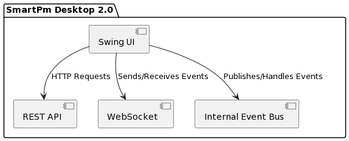

# Architecture Overview

## Components:

- **Swing UI:** User Interface of the Swing Application.
- **REST API:** Allows communication with external services via HTTP requests.
- **WebSocket:** Facilitates real-time bidirectional communication for events.
- **Internal Event Bus:** Manages in-app event handling and propagation.

## Functionality:

- **Swing UI:** Renders the graphical user interface and interacts with the user.
- **REST API:** Sends HTTP requests to external services to fetch or modify data.
- **WebSocket:** Enables real-time event-based communication with external systems or servers.
- **Internal Event Bus:** Handles and propagates events within the application, allowing components to communicate
  internally.

